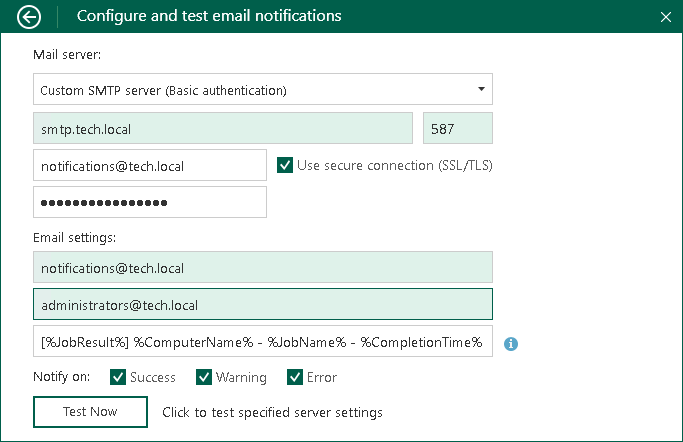

# Custom SMTP Server Settings

To connect to the SMTP server, specify the following settings in the Configure and test email notifications window:

1. In the Mail server section, specify the following:

1. Select the Custom SMTP Server (Basic authentication) option from the drop-down list.
2. In the SMTP Server DNS Name or IP address field, enter a full DNS name or IP address of the SMTP server that will be used for sending email notifications.
3. In the Port field, specify the port number for the SMTP server.

|  |
| --- |
| NOTE |
| Sending email notifications using Implicit TLS (over port 465) is not supported. For more information about Implicit TLS, see [this RFC section](https://www.rfc-editor.org/rfc/rfc8314#section-3). |

1. In the Username field, specify a user name for the account that has rights to access the SMTP server.
2. In the Password field, enter a password for the account that has rights to access the SMTP server.
3. To use a secure SSL/TLS connection for email operations, select the Use secure connection (SSL/TLS) check box.

1. In the Email settings section specify the following:

1. Specify the sender email address in the From email address field. You can specify your account email address or its alias.
2. Specify the recipient email address in the To email address field. You can specify several recipient email addresses separated with a comma or semicolon.
3. In the Email subject filed, specify a subject for the message. You can use the following variables in the subject:

1. %JobResult%
2. %ComputerName%
3. %JobName%
4. %CompletionTime%

1. In the Notify on section, select the Success, Warning or Error check boxes to receive email notification if a job is run successfully, not successfully or with a warning.
2. [Optional] Click Test now to validate the SMTP server settings and send a test email.

