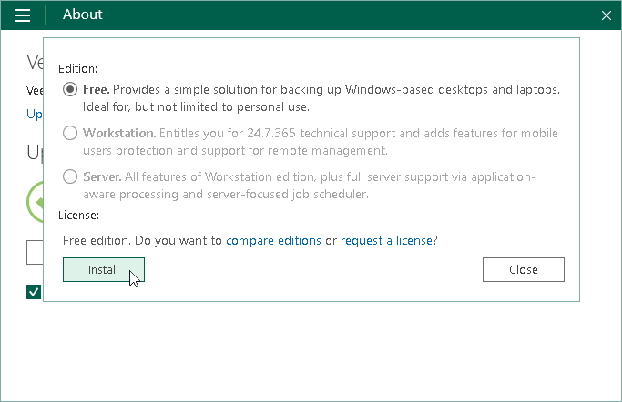

# Installing License

When you launch the Veeam Agent control panel for the first time, Veeam Agent displays a notification window offering to install a license. You can choose to install the license immediately or postpone this operation.

* If you choose to install the license, you can immediately browse for the license key on your computer and complete the license installation process.
* If you choose to postpone the license installation process, you will be able to install a license later at any time you need.

Until you install a license, you can use the Free edition of the product. To switch to a commercial version of Veeam Agent for Microsoft Windows, you need to obtain and install a license.

|  |
| --- |
| NOTE |
| If you plan to use a Veeam Backup & Replication repository as a target location for Veeam Agent backups, you must install a license in Veeam Backup & Replication. The license must have enough instances to protect machines with Veeam Agents that back up data to the Veeam Backup & Replication repository. To learn more, see [Managing License](license_vbr.md). |

To install a license:

1. Double-click the Veeam Agent for Microsoft Windows icon in the system tray, or right-click the Veeam Agent for Microsoft Windows icon in the system tray and select Control Panel.
2. From the main menu, select About.
3. In the Version section, click the following link:

1. Update license to get additional features — if the license is not installed yet, and you run the Free edition of Veeam Agent for Microsoft Windows.
2. Manage license and edition — if the license is already installed on the Veeam Agent computer, and you want to change the license or select the product edition.

1. In the dialog window, click Install and browse for the LIC file.

Veeam Agent for Microsoft Windows will install the license and select the product edition that is allowed by the license. If a license supports both the Workstation and Server editions, Veeam Agent for Microsoft Windows will select the product edition based on the type of the Microsoft Windows OS installed on the Veeam Agent computer.

You can change the product edition manually if needed. To learn more, see [Selecting Product Edition](settings_mode.md).

