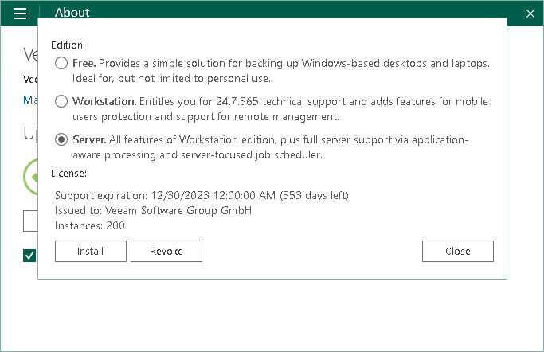

# Selecting Product Edition

When you install a license, Veeam Agent for Microsoft Windows automatically selects the product edition that is allowed by the license. If a license supports both the Workstation and Server editions, Veeam Agent for Microsoft Windows will select the product edition based on the type of the Microsoft Windows OS installed on the Veeam Agent computer.

You can change the product edition manually if needed. To select the product edition:

1. Double-click the Veeam Agent for Microsoft Windows icon in the system tray, or right-click the Veeam Agent for Microsoft Windows icon in the system tray and select Control Panel.
2. From the main menu, select About.
3. In the Version section, click Manage license and edition.
4. In the dialog window, in the Edition section, select the desired product edition. To learn more about editions of Veeam Agent for Microsoft Windows, see [Product Editions](license_editions.md).

|  |
| --- |
|  NOTE |
| After you switch from the Server edition to the Workstation edition, or vice versa, Veeam Agent for Microsoft Windows will disable the backup job. To enable the job, you must review and update the backup job settings in accordance with the selected edition. |

