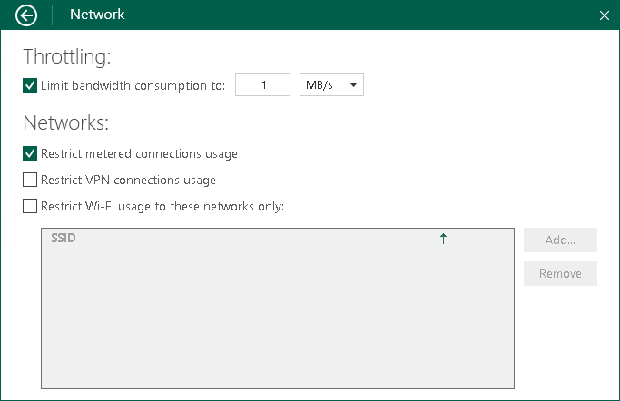

# Limiting Bandwidth Consumption

To reduce the impact of Veeam Agent operations on network performance, you can limit bandwidth consumption for Veeam Agent backup jobs. Limiting bandwidth consumption prevents jobs from utilizing the entire bandwidth available in your environment to ensure that enough traffic is provided for other network operations. We strongly recommend to limit bandwidth consumption if you perform backup to a remote location over a slow network connection.

|  |
| --- |
|  NOTE |
| Bandwidth consumption limit does not apply to restore operations. |

By default, Veeam Agent is set up to use the entire bandwidth available in your environment. To limit bandwidth consumption for Veeam Agent backup jobs:

1. Double-click the Veeam Agent for Microsoft Windows icon in the system tray, or right-click the Veeam Agent for Microsoft Windows icon in the system tray and select Control Panel.
2. From the main menu, select Settings.
3. Click the Manage networks link.
4. In the Throttling section, select the Limit bandwidth consumption to check box and specify the maximum speed for transferring backed-up data from the Veeam Agent computer to the target location.

