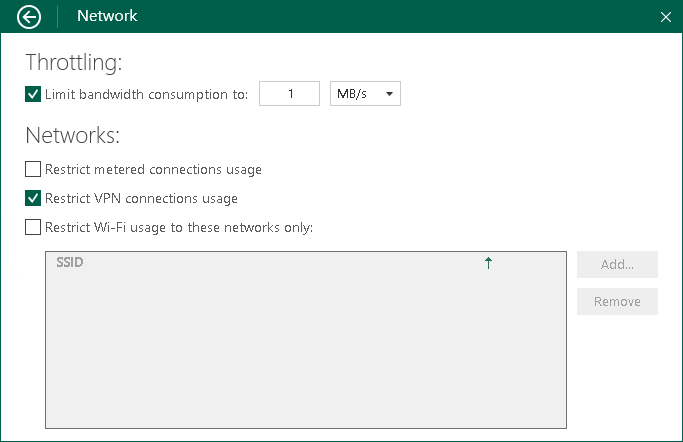

# Disabling Backup over VPN Connections

Veeam Agent can disable backup over VPN connections. This helps you avoid extra costs if your VPN service provider charges you by the amount of data sent and received by your computer. Veeam Agent automatically detects VPN connections and will not perform backup when your computer is on such connection.

By default, backup over VPN connections is enabled. To disable backup over VPN connections:

1. Double-click the Veeam Agent for Microsoft Windows icon in the system tray, or right-click the Veeam Agent for Microsoft Windows icon in the system tray and select Control Panel.
2. From the main menu, select Settings.
3. Click the Manage networks link.
4. In the Networks section, select the Restrict VPN connections usage check box.

Keep in mind that Veeam Agent detects VPN connections created with Microsoft Windows in-built tools and the following 3rd party VPN providers:

* Cisco AnyConnect
* Fortinet SSL VPN
* Open VPN
* Palo Alto Networks GlobalProtect VPN

|  |
| --- |
|  NOTE |
| For the cases when backup over VPN connections is disabled, consider the following:   * If you start the backup job manually when only a VPN connection is available, Veeam Agent will display a warning and ask you to confirm that you want to use this connection for backup.  * If you start the backup job with the command line interface, Veeam Agent will ignore the setting and will use VPN connections for backup.  * If you enable the backup cache for the backup job, and this backup job starts upon schedule when only a VPN connection is available, Veeam Agent will save the backup file to the backup cache. If the backup cache is not enabled, the backup job will fail. |

