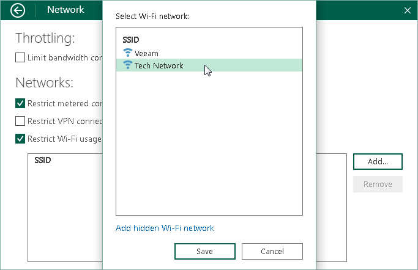

# Selecting Wireless Networks for Backup

You can restrict usage of Wi-Fi networks for Veeam Agent for Microsoft Windows. This may be useful, for example, to avoid transmission of backed-up data over insecure or slow wireless network connections.

By default, Veeam Agent for Microsoft Windows is set up to back up data over any Wi-Fi network to which the Veeam Agent computer is connected. You can select one or more specific Wi-Fi networks and instruct Veeam Agent for Microsoft Windows to perform backup over these networks only. Backup over other wireless networks will be disabled.

To restrict usage of wireless networks:

1. Double-click the Veeam Agent for Microsoft Windows icon in the system tray, or right-click the Veeam Agent for Microsoft Windows icon in the system tray and select Control Panel.
2. From the main menu, select Settings.
3. Click the Manage networks link.
4. Select the Restrict Wi-Fi usage to these networks only check box and click Add.
5. Select one or more Wi-Fi networks in the list and click Save.

If you want to allow Veeam Agent to back up data over a hidden wireless network, click the Add hidden Wi-Fi network link. In the displayed window, specify the SSID of the necessary network and click Save.

If you want to restrict usage over any wireless networks, select the Restrict Wi-Fi usage to these networks only check box and do not add any networks to the list.

|  |
| --- |
|  NOTE |
| For the cases when backup over Wi-Fi networks is restricted, consider the following:   * If you start the backup job manually when selected Wi-Fi networks are not available, Veeam Agent for Microsoft Windows will display a warning and ask you to confirm that you want to use the current wireless connection for backup.  * If you start the backup job with the command line interface, Veeam Agent will ignore the setting and will use all available Wi-Fi networks for backup.  * If you enable the backup cache for the backup job, and this backup job starts upon schedule when selected Wi-Fi networks are not available, Veeam Agent for Microsoft Windows will save the backup file to the backup cache. If the backup cache is not enabled, the backup job will fail. |

