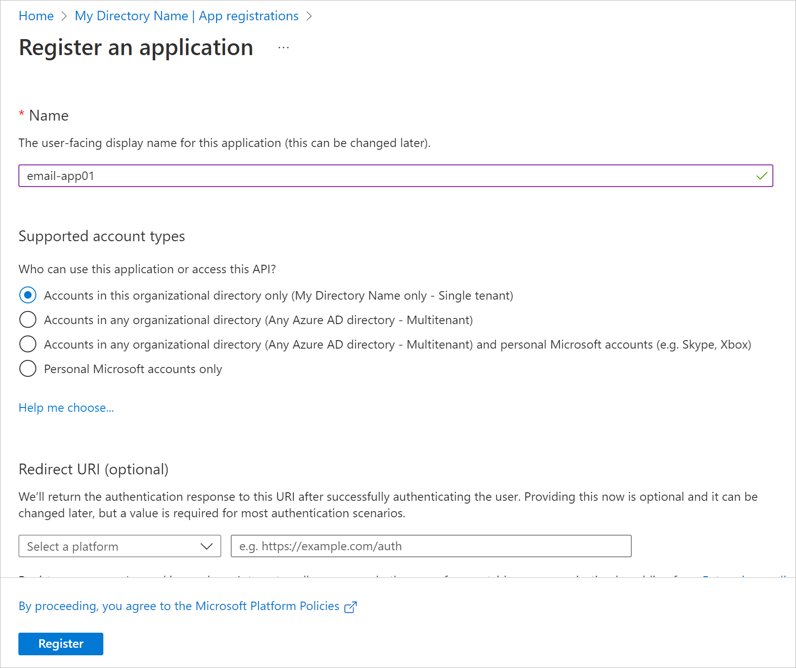
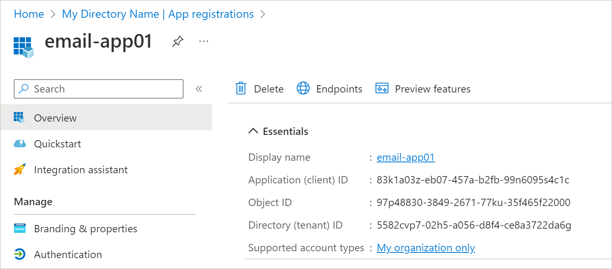
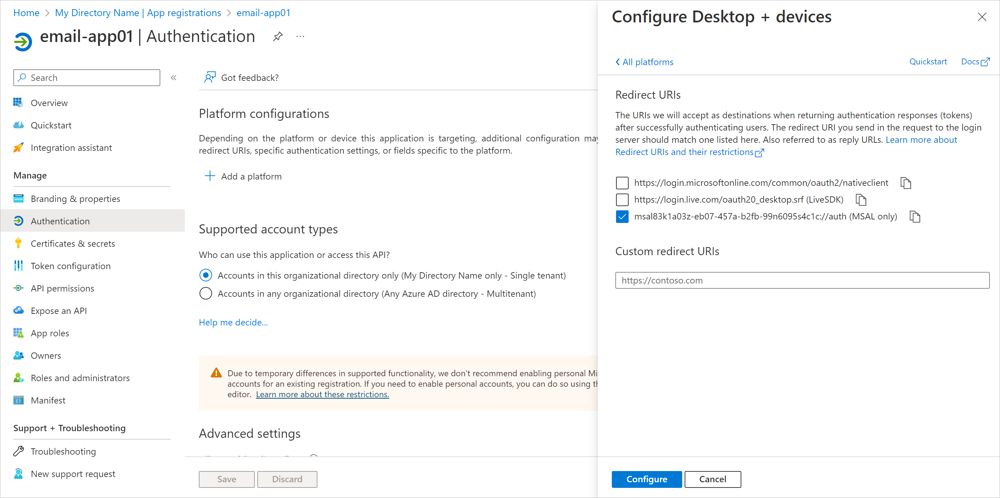
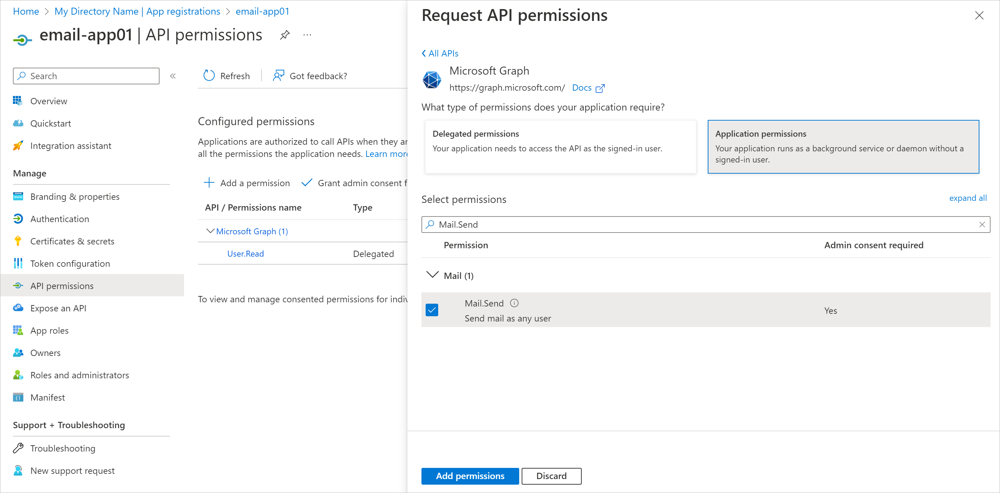
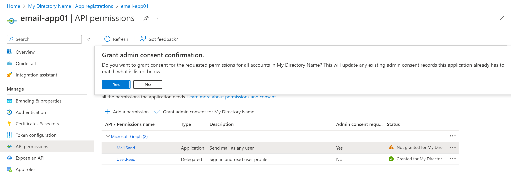

# Registering Application in Microsoft Azure Portal

If you want to use your own web application for email notifications, you need to configure it in the Microsoft Azure portal. To do this, perform the following steps:

1. Log in to the [Microsoft Azure portal](https://portal.azure.com/) under Exchange Online credentials that has permissions to register Azure AD applications.
2. Register the application. To do this, open Azure Active Directory > App registrations and click New registration:

1. In the Name field, specify the name of your application.
2. In the Supported account types section, select the Accounts in this organizational directory only option.
3. Click Register.

After registration, you can copy application (client) ID and directory (tenant) ID. You can also find these credentials later in the Overview section of you application properties.

1. Add a platform configuration for your application. To do this, open Authentication > Platform configurations and click Add a platform:

1. Select Mobile and desktop applications.
2. Select the MSAL redirect URI generated in the following format: msal<applicationid>://auth.
3. Click Configure.

1. Grant the application the Mail.Send permission of Microsoft Graph. This will allow Veeam Agent for Microsoft Windows to call the Microsoft Graph API for sending email notifications. To do this, open API permissions and click Add a permission:

1. Select Microsoft Graph > Application Permissions.
2. Select the Mail.Send permission from the list and click Add permissions.

1. Click Grant admin consent for <Your Directory Name>. In the displayed window, click Yes to confirm the operation.

After you finish the registration, specify custom application registration settings when configuring the mail server for Microsoft 365 OAuth 2.0 authentication. For more information, see [Microsoft 365 Server Settings](settings_enable_email_notifications_microsoft.md).

