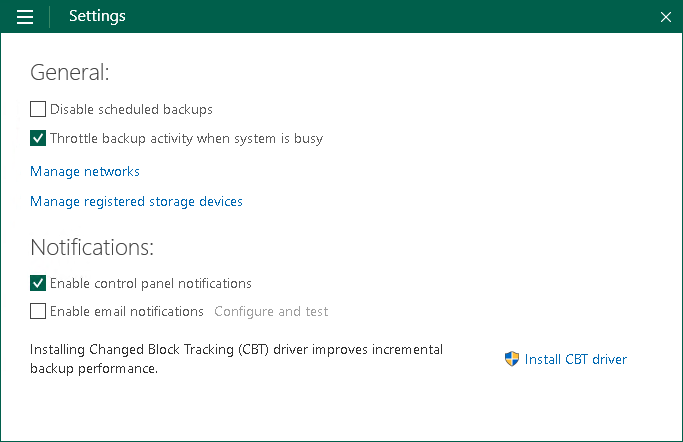

# Throttling Backup Activities

You can instruct Veeam Agent for Microsoft Windows to throttle its activities during backup. The throttling option can help you avoid situations when backup tasks consume all available hard disk resources and hinder work of other applications and services.

With throttling enabled, Veeam Agent for Microsoft Windows sets low priority for Veeam Agent for Microsoft Windows components engaged in the backup process (in particular, the VeeamAgent.exe process). If this option is not enabled, Veeam Agent for Microsoft Windows components have normal priority.

To enable the throttling option for backup activities:

1. Double-click the Veeam Agent for Microsoft Windows icon in the system tray, or right-click the Veeam Agent for Microsoft Windows icon in the system tray and select Control Panel.
2. From the main menu, select Settings.
3. Select the Throttle backup activity when system is busy check box.

