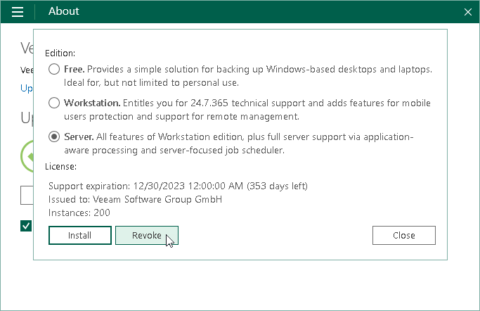

# Revoking License

You can revoke a license at any time if needed, for example, after the license is expired, and you want to continue using the Free edition of Veeam Agent for Microsoft Windows.

To revoke a license:

1. Double-click the Veeam Agent for Microsoft Windows icon in the system tray, or right-click the Veeam Agent for Microsoft Windows icon in the system tray and select Control Panel.
2. From the main menu, select About.
3. In the Version section, click Manage license and edition.
4. In the dialog window, click Revoke.

