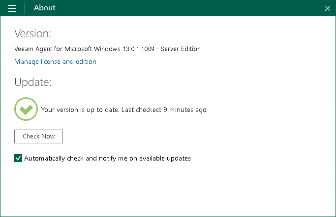

# Checking for New Product Versions and Updates

You can set up Veeam Agent for Microsoft Windows to automatically notify you about new product versions and updates. When a new version or patch becomes available, Veeam Agent for Microsoft Windows displays a notification in the notification bar. You can download the setup file and update Veeam Agent for Microsoft Windows. To learn more, see [Upgrading Veeam Agent for Microsoft Windows](upgrade_process.md).

By default, automatic notifications are enabled. To disable notifications:

1. Double-click the Veeam Agent for Microsoft Windows icon in the system tray, or right-click the Veeam Agent for Microsoft Windows icon in the system tray and select Control Panel.
2. From the main menu, select About.
3. In the Update section, clear the Automatically check and notify me on available updates check box.

To manually check if product updates are available, click Check Now.

|  |
| --- |
|  NOTE |
| Consider the following:   * To get information about available product updates, Veeam Agent for Microsoft Windows sends request to the Veeam Update Notification Server (agents.butler.veeam.com). * For downloading setup files, Veeam Agent uses the Background Intelligent Transfer Service (BITS). If this service is disabled on the Veeam Agent computer, Veeam Agent for Microsoft Windows will not be able to download a setup file. |

Related Topics

[Upgrading Veeam Agent for Microsoft Windows](upgrade_process.md)

