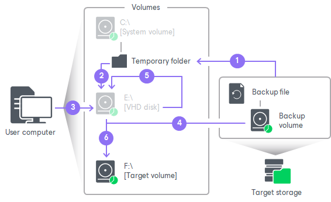

# How Volume Shrink Works

When you restore a volume to a target location of the smaller size, Veeam Agent for Microsoft Windows performs the following operations:

1. When you select the Resize option to shrink a volume, Veeam Agent for Microsoft Windows mounts the backup volume to a temporary NTFS folder on the system drive, for example: C:\Users\Username\AppData\Local\Temp.
2. Veeam Agent for Microsoft Windows mounts the created NTFS folder as a VHD disk next to other disks that are present on the computer.

Mounting VBK file content as a VHD disk makes it possible for Veeam Agent for Microsoft Windows to use Microsoft Windows system's disk management tools to measure current size of the backup volume and maximum and minimum size for the restored volume.

1. Veeam Agent for Microsoft Windows sends a query request to the mounted VHD disk to calculate its size, amount of stored data and free disk space by which the volume can be shrunk.

This step may take some time depending on the size of the backup volume and its data fragmentation ratio.

When the query is complete and you specify the desired size for the restored volume, Veeam Agent for Microsoft Windows unmounts the VHD disk.

1. When you start the restore process, Veeam Agent for Microsoft Windows creates on the target disk a volume of the specified size and restores to that volume the amount of backed-up data that fits the specified size.
2. Veeam Agent for Microsoft Windows mounts the backup volume as a VHD disk as described in steps 1 and 2 and starts to shrink it to the size of the target volume. During the process of volume shrink, empty data blocks from the part of the mounted VHD disk that does not fit the size of the target volume are moved to the part of the disk that contains actual data.
3. Veeam Agent for Microsoft Windows captures on the VHD disk data blocks that are moved during shrink and writes them to the target volume.

When all data blocks are written to the target volume, Veeam Agent for Microsoft Windows unmounts the VHD disk.

