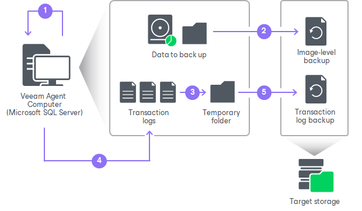

# How Microsoft SQL Server Log Backup Works

The transaction log backup for Microsoft SQL Server is performed in the following way:

1. Veeam Agent for Microsoft Windows launches the parent backup job by schedule.
2. The parent backup job creates a volume-level or file-level backup and stores it to the backup location.
3. A new session of the transaction log backup job starts. Veeam Agent for Microsoft Windows copies transaction log files from the log archive destination (set by the Microsoft SQL Server administrator) to a temporary folder on the Veeam Agent computer file system.
4. Veeam Agent for Microsoft Windows detects what databases currently exist on the Microsoft SQL Server and maps this data with the information kept in the Veeam Agent for Microsoft Windows database. This periodic mapping reveals the databases for which Veeam Agent for Microsoft Windows must process transaction logs during this time interval.
5. Veeam Agent for Microsoft Windows transports transaction log backup copies from the temporary folder to the backup location and saves them as VLB files. As soon as copies of transaction log backups are saved to the backup location, transaction log backups in the temporary folder on the Veeam Agent computer are removed.

|  |
| --- |
| TIP |
| Default location of the temporary folder where Veeam Agent copies transaction log files to is C:\ProgramData\Veeam\Endpoint\SqlLogBackup. If it is necessary to change the location, you can use a registry value. To learn more, see [this Veeam KB article](https://www.veeam.com/kb2642). |

The session of the transaction log backup job remains working until the next start of the parent backup job. When a new session of the parent job starts, the transaction log backup job stops the current session and then starts a new session, performing steps 1–5.

Transaction logs that for some reason were not processed during the log backup interval remain in the temporary folder and are processed during the next log backup interval. To detect these remaining logs, Veeam Agent for Microsoft Windows enumerates log files in the temporary folder.

|  |
| --- |
| NOTE |
| If a new session of the transaction log backup starts and the parent backup job has not created a new restore point yet, the transaction log backup job will remain in the idle state, waiting for a new restore point to be created. |

