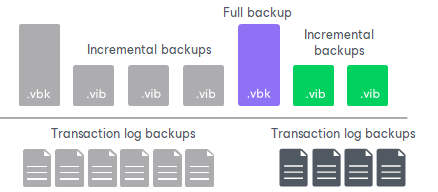
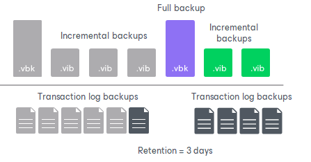

# Retention for Database Log Backups

Transaction log backups are stored in files of the proprietary Veeam format — VLB. Veeam Agent for Microsoft Windows keeps transaction log backups together with the chain of backup files on the target location.

Veeam Agent for Microsoft Windows removes transaction log backups by retention. You can choose one of the following retention methods:

* [Retain logs according to the image-level backup](sql_backup_retention.md#backup)
* [Retain logs for the specified number of days](sql_backup_retention.md#days)

Retain Logs with Image-Level Backup

By default, Veeam Agent for Microsoft Windows retains transaction log backups together with the corresponding backup file. When Veeam Agent for Microsoft Windows removes a restore point from the backup chain, it also removes a chain of transaction logs relating to this restore point.

This method allows you to have both the file-level or volume-level backup and necessary transaction log backups at hand. If you need to recover a database to some state, you can restore a machine running Microsoft SQL Server or Oracle from the necessary restore point and perform transaction log replay to bring the database to the desired state.

Retain Logs for a Number of Days

You can instruct Veeam Agent for Microsoft Windows to keep transaction logs only for a specific period of time. This retention setting can be used, for example, if you want to save on storage space and plan to retain transaction log backups for the last few days. In this case, you will be able to perform transaction log replay only to one of the most recent states.

If you select this retention method, you must make sure that retention policies for the Veeam Agent backup and transaction log backup are consistent. The restore point of the volume-level or file-level backup must always be preserved. If a backup of the database itself is missing, you will not be able to perform transaction log replay.

