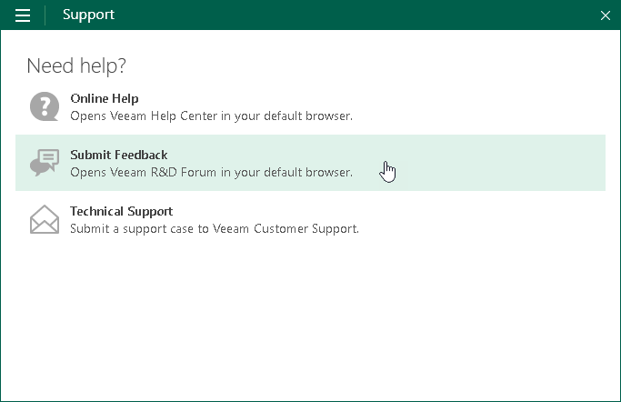

# Getting Support

If you have any questions or want to share your feedback about Veeam Agent, you can use one of the following options:

* You can search for the information on the necessary subject in the current Veeam Agent for Microsoft Windows User Guide.

* You can visit [Veeam R&D Forums](https://forums.veeam.com) and share your opinion or ask a question.
* You can submit a support case to the Veeam Customer Support directly from the product. To learn more, see [Reporting Issues](support_report.md).

To access help and support options in Veeam Agent:

1. Right-click the Veeam Agent for Microsoft Windows icon in the system tray and select Control Panel.
2. From the main menu, select Support.
3. Click one of available options to get support on the product.

