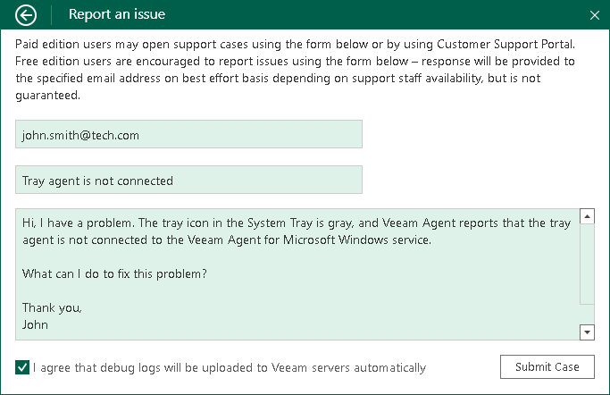

# Reporting Issues

You can submit a support case in the Control Panel. To submit a support case:

1. Double-click the Veeam Agent for Microsoft Windows icon in the system tray, or right-click the Veeam Agent for Microsoft Windows icon in the system tray and select Control Panel.
2. From the main menu, select Support.
3. Click Technical Support.
4. In the email field of the Report an issue window, enter a valid email address.

If the email address that you have entered in not registered at the [Veeam Customer Support Portal](https://www.veeam.com/support.html), click Register on the right of the email field. Veeam Software will register your email address and send you a verification email to the specified address. When you receive a verification email, open it and click a link provided in the email to complete the verification procedure. After the verification procedure is complete, you will be able to submit a support case.

1. In the description fields, enter a short and detailed description of your problem.
2. Select the I agree that debug logs will be uploaded to Veeam servers automatically check box and click Submit Case.

Veeam Agent will automatically collect logs from your computer (without additional warnings) and open a support case at the [Veeam Customer Support Portal](https://www.veeam.com/support.html).

|  |
| --- |
|  IMPORTANT |
| Consider the following:   * If you have any questions about the product functionality, do not submit a support case through the [Veeam Customer Support Portal](https://www.veeam.com/support.html) and do not send an email to the Veeam Customer Support directly. To submit a support case, use the Control Panel in Veeam Agent for Microsoft Windows.  * You can submit a support case only in the Control Panel of the current version of Veeam Agent. If you use an older version of Veeam Agent, upgrade Veeam Agent and check whether the problem still exists in the current version. If the problem exists, use the Control Panel to submit a support case. |

