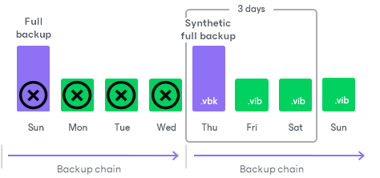

# Synthetic Full Backup

In some situations, running active full backups periodically may not be an option. Active full backups are resource-intensive and consume considerable amount of network bandwidth. As an alternative, you can create synthetic full backups.

|  |
| --- |
| NOTE |
| Consider the following:   * Synthetic full backup is available only in the Workstation and Server editions of Veeam Agent. * Synthetic full backup is not available for backup jobs targeted at an object storage repository. |

In terms of data, the synthetic full backup is identical to a regular full backup. Synthetic full backup produces a .VBK file that contains all data that you have chosen to back up. The difference between active and synthetic full backup lies in the way how backed-up data is retrieved:

* When you perform an active full backup, Veeam Agent reads backed-up data, compresses it and copies it to the target location.
* When you perform a synthetic full backup, Veeam Agent does not retrieve all backed-up data from the Veeam Agent computer. Instead, it creates a new incremental backup and then synthesizes a full backup from data you already have on the target location. Veeam Agent accesses the previous full backup file and a chain of subsequent incremental backup files in the backup chain including a new incremental backup, consolidates data from these files and writes consolidated data into a new full backup file. As a result, the created synthetic full backup file contains the same data as an active full backup.

Consider the following advantages of synthetic full backup:

* Synthetic full backup does not use network resources: it is created from backup files you already have in the target location.
* Synthetic full backup produces less load on the production environment: it is synthesized directly in the target location.

Veeam Agent treats synthetic full backups as regular full backups. As well as any other full backup file, a synthetic full backup file resets the backup chain. All subsequent incremental backup files use the synthetic full backup file as a new starting point.

A previously used full backup file and its subsequent incremental backup files remain on the disk. After the last incremental backup file created prior to the synthetic full backup becomes outdated, Veeam Agent automatically deletes the previous backup chain. To learn more, see [Retention Policy for Synthetic Full Backups](#retention).

To create synthetic full backups, you must enable the Create synthetic full backups periodically option and schedule synthetic full backups in the backup job settings.

Retention Policy for Synthetic Full Backups

To restore data from a Veeam Agent backup, you must have a full backup file and a chain of subsequent incremental backup files on the disk. If you delete the full backup file, the whole chain of incremental backup files becomes useless. Likewise, if you delete any incremental backup file that precedes the point to which you want to roll back, you will also not be able to restore data because any incremental backup file also depends on the preceding incremental backup files in the backup chain.

For this reason, if you schedule synthetic full backups, on some days there will be more restore points on the disk than specified by the retention policy settings.

For example, you configure a backup job in the following way:

* The backup job starts on Sunday and is scheduled to create one incremental backup file per day, every day.
* Retention policy is set to 3 days.
* Weekly synthetic full backups are scheduled on Thursdays.

The first full backup file is created on Sunday, incremental backup files are created daily, and a synthetic full backup is created on Thursday. Although the retention policy is reached on Wednesday, the full backup is not deleted. Without a full backup, the backup chain is useless and leaves you without any restore point at all. Veeam Agent will wait for 2 days to pass after the synthetic full backup, and only after that will it delete the whole previous chain, which will happen on Sunday.

