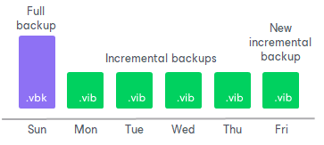
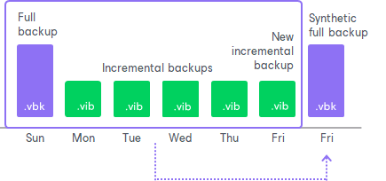
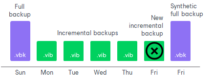

# How Synthetic Full Backup Works

To create a synthetic full backup, Veeam Agent for Microsoft Windows performs the following steps:

1. On a day when synthetic full backup is scheduled, Veeam Agent for Microsoft Windows triggers a new backup job session. During this session, Veeam Agent for Microsoft Windows first performs incremental backup in a regular manner and adds a new incremental backup file to the backup chain. Incremental backup helps Veeam Agent for Microsoft Windows ensure that the synthetic full backup includes the latest changes of the backed-up data.

1. At the end of the backup job session, Veeam Agent for Microsoft Windows builds a new synthetic full backup using backup files that are already available in the backup chain, including the newly created incremental backup file.

1. When the synthetic full backup is created, Veeam Agent for Microsoft Windows deletes the incremental backup file created at the beginning of the job session. As a result, you have a backup chain that consists of a full backup file, set of incremental backup files and synthetic full backup file.

1. Every next job session creates a new incremental restore point starting from the synthetic full backup until the day on which synthetic full backup is scheduled. On this day, Veeam Agent for Microsoft Windows creates a new synthetic full backup.

