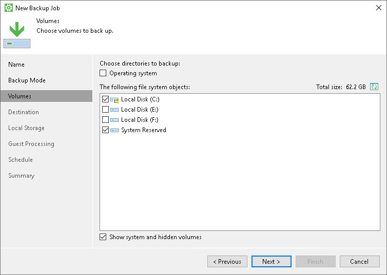
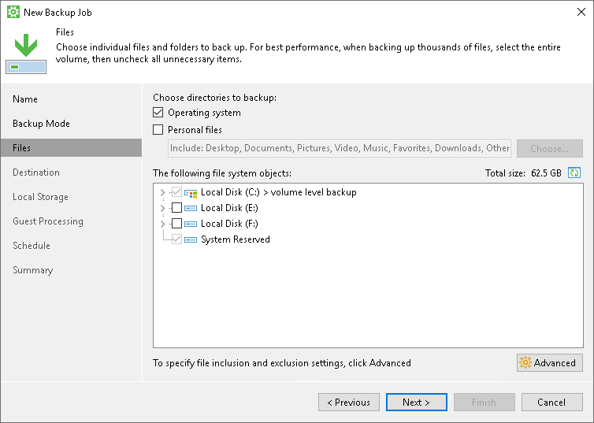
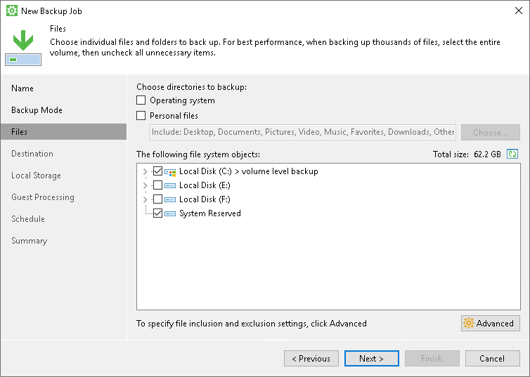

# System State Data Backup

To be able to restore critical components related to the OS and start the OS after recovery, you must include in the backup the system volume (volume on which the OS is installed) and the System Reserved/UEFI or other system partitions. To simplify this process, Veeam Agent for Microsoft Windows offers you to add the Operating system component to the backup scope. When you select to back up the operating system data, Veeam Agent automatically includes in the backup all data related to the OS. You can include the operating system data in the volume-level and file-level backup.

System State Backup in Volume-Level Backup

To include the operating system data in the volume-level backup, select the Operating system check box. When you select to back up the operating system data, Veeam Agent automatically includes in the backup the system volume and existing system partitions. If some additional system partitions appear on the Veeam Agent computer in the future, for example, after the OS upgrade, Veeam Agent will add these partitions to the backup scope too.

Alternatively, you can explicitly select to back up the system volume. When you select to back up the system volume, Veeam Agent automatically includes existing system partitions in the backup. However, if additional system partitions appear on the Veeam Agent computer, Veeam Agent may be unable to back up such volumes. Thus, we recommend that you use the Operating system option to create system state data backup.

System State Backup in File-Level Backup

To include the operating system data in the file-level backup, select the Operating system check box. When you select to back up the operating system data, Veeam Agent automatically includes in the backup all data related to the OS: the system volume and existing system partitions.

Alternatively, you can manually select to back up the system volume and system partitions.

In this case, you will be able to exclude specific folders related to the OS from the backup (for example, the Users folder and Documents and Settings folder). When you select to back up the Operating system data, you cannot choose which components related to the OS must be backed up and which must be excluded.

Related Tasks

[Selecting Backup Mode](backup_job_mode.md)

