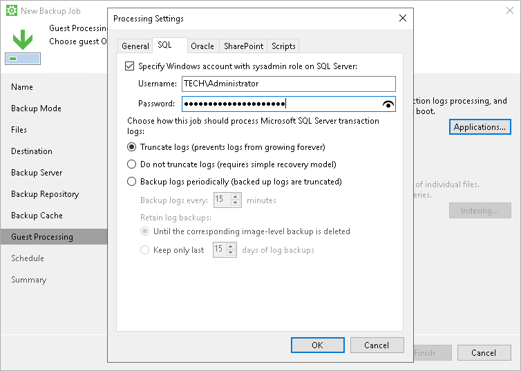

# Transaction Log Truncation

If you back up database systems that use transaction logs, for example, Microsoft SQL Server, you can instruct Veeam Agent for Microsoft Windows to truncate transaction logs so that logs do not overflow the storage space. Veeam Agent for Microsoft Windows provides the following options of transaction logs handling:

* [Truncate logs](transaction_truncation.md#truncate)
* [Do not truncate logs](transaction_truncation.md#not_truncate)
* [Back up logs periodically](transaction_truncation.md#backup)

Truncate Logs

You can instruct Veeam Agent for Microsoft Windows to truncate logs after a backup is successfully created. With this option selected, Veeam Agent for Microsoft Windows behaves in the following way:

* If the backup job completes successfully, Veeam Agent for Microsoft Windows produces a backup file and truncates transaction logs on the Veeam Agent computer. As a result, you have the backup file that contains a computer image, image of a specific data volume or individual folders at a specific point in time.

In this scenario, you can recover a database to the point in time when the backup file was created. As transaction logs on the Veeam Agent computer are truncated, you cannot use them to get the restored database to some point in time between backup job sessions.

* If the backup job fails, Veeam Agent for Microsoft Windows does not truncate transaction logs on the Veeam Agent computer. In this scenario, you can restore computer data from the most recent point in the backup and use database system tools to apply transaction logs and get the database system to the necessary point in time after the restore point.

Do not Truncate Logs

You can choose not to truncate transaction logs. We recommend this option if you use another backup tool together with Veeam Agent for Microsoft Windows.

For example, you can use Veeam Agent for Microsoft Windows to create a computer image backup and instruct the native Microsoft SQL Server log backup job to back up transaction logs. If you truncate transaction logs with Veeam Agent for Microsoft Windows, the chain of transaction logs will be broken, and the Microsoft SQL Server log backup job will not be able to produce a consistent log backup.

With this option selected, Veeam Agent for Microsoft Windows produces a backup file and does not trigger transaction log truncation. As a result, you have a backup file that contains a computer image, image of a specific data volume or individual folders captured at a specific point in time, and transaction logs. You can use transaction logs to restore the Veeam Agent computer to any point in time between job sessions. To do this, you must recover data from the backup file and use database system tools to apply transaction logs and get the database system to the necessary point in time.

Back Up Logs Periodically

This option can be used if you back up Microsoft SQL Server or Oracle database system.

You can choose to back up database logs with Veeam Agent for Microsoft Windows. With this option selected, Veeam Agent for Microsoft Windows creates a backup and additionally copies Microsoft SQL Server transaction logs or Oracle archived logs and saves them to the backup location next to the backup files. To learn more, see [Microsoft SQL Server and Oracle Logs Backup](sql_backup.md).

In this scenario, you can use transaction logs to restore the Veeam Agent computer to any point in time between backup job sessions. To do that, you must recover data from the Veeam Agent backup and use Veeam Explorer for Microsoft SQL Server or Veeam Explorer for Oracle to perform transaction log replay and get the database system to a necessary point in time.

Related Topics

* [Copy Only Backup](copy_only.md)
* [Microsoft SQL Server and Oracle Logs Backup](sql_backup.md)

Related Tasks

[Creating Backup Jobs](backup_job_create.md)

