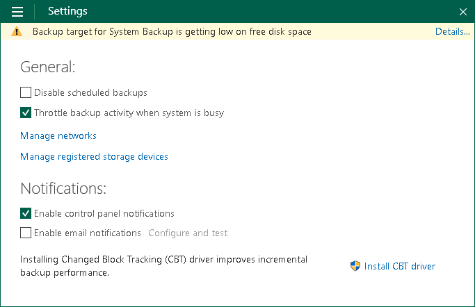
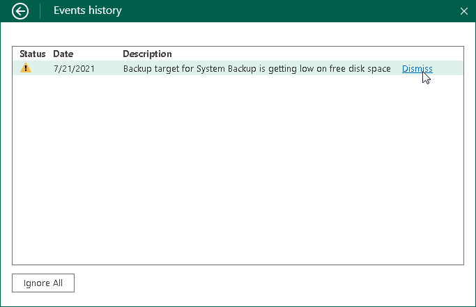

# Viewing and Dismissing Veeam Agent Events

If a warning event occurs, Veeam Agent displays a notification bar with the event description in the control panel window. You can get detailed information about events and dismiss events not to get alerted of them in future. For the full list of notifications, see [Control Panel Notifications](#panelntf).

Veeam Agent displays only the latest event in the notification bar. To view detailed information about all events:

1. Double-click the Veeam Agent icon in the system tray, or right-click the Veeam Agent icon in the system tray and select Control Panel.
2. Click Details on the notification bar at the top of the control panel window.

To dismiss events:

1. Double-click the Veeam Agent for Microsoft Windows icon in the system tray, or right-click the Veeam Agent for Microsoft Windows icon in the system tray and select Control Panel.
2. Click Details on the notification bar at the top of the control panel window.
3. Click Dismiss next to the necessary event. To dismiss all events at once, click Ignore All at the bottom left corner of the window.

|  |
| --- |
|  TIP |
| You can disable notifications at all. To learn more, see [Disabling Control Panel Notifications](settings_disable_notifications.md). |

Control Panel Notifications

Veeam Agent for Microsoft Windows can inform you about the following events using the notification bar:

| Notification | Description |
| --- | --- |
| New software update is available | A newer version of Veeam Agent for Microsoft Windows is available for download. |
| Veeam Recovery Media must be recreated due to a recent Veeam Agent for Microsoft Windows upgrade | You must recreate the Veeam Recovery Media after you have upgraded Veeam Agent for Microsoft Windows to the newer version. |
| Recovery media OS version is different from the current OS version | You must recreate the Veeam Recovery Media after you have updated the Microsoft Windows OS. |
| Recovery media has not been created | You have not created the Veeam Recovery Media yet. If the OS on the computer fails to boot, you will not be able to boot the OS using the Veeam Recovery Media to diagnose and fix problems, or restore data from the backup. |
| Backup target is not available, backup is postponed | Veeam Agent for Microsoft Windows is unable to detect the backup target at the time when the scheduled backup job must start (for example, the backup target is a removable storage device that is not currently connected to the Veeam Agent computer). Veeam Agent for Microsoft Windows displays this notification during the job retry sessions. |
| Backup target is not available | Veeam Agent for Microsoft Windows is unable to detect the backup target by the moment when the scheduled backup job must start (for example, backup target is a removable storage device that is not currently connected to the Veeam Agent computer). Veeam Agent for Microsoft Windows displays this notification after the job has failed. |
| Backup target has not been seen for <N> days | The backup target has not been seen for <N> days. This notification is displayed if scheduled backups have not been created for 2 days or more. |
| Backup target is getting low on free disk space | Free space on the target storage disk is below 10%. If Veeam Agent for Microsoft Windows does not have enough disk space for backup operation, the job session will fail. |
| Skipping scheduled backup, because battery level is too low | [For laptops and tablets] The battery level is below 20%. Veeam Agent for Microsoft Windows does not start a new backup session in this case. |
| This application is managed by your system administrator | This notification is displayed if Veeam Agent for Microsoft Windows is operating in the read-only mode. Veeam Agent for Microsoft Windows operates in the read-only mode if backup operations are managed by Veeam Backup & Replication or Veeam Service Provider Console. |
| Your license will expire in <N> days | The Veeam Agent for Microsoft Windows license will expire, and the grace period will start in <N> days. |
| Your license has expired and needs to be renewed | The Veeam Agent for Microsoft Windows license has expired, and the grace period has started. During the grace period, you can perform all types of backup and restore operations. You must obtain a new license before the end of the grace period. |
| Your license has expired, and your grace period is over | The Veeam Agent for Microsoft Windows license has expired, and the grace period is over. In this case, Veeam Agent for Microsoft Windows does not perform backup operations. However, you are able to restore data from existing backups. To use Veeam Agent for Microsoft Windows in the full functionality mode, you must obtain a new license. |

