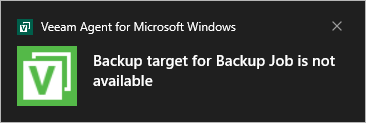

# Viewing Events with Windows Notification Center

In addition to displaying notifications about Veeam Agent events in the control panel window, Veeam Agent can inform you about its events using the Windows Notification Center. Once an event occurs, a message notifying about this event will appear on the Microsoft Windows desktop. This lets you view the notification without the need to open the Veeam Agent Control Panel and take the necessary actions immediately. For the full list of notifications that appears on the Microsoft Windows desktop, see [Windows Desktop Notifications](#winntf).

The notification closes automatically in a few seconds. To close the notification manually, click the message.

To disable desktop notifications, right-click the message and select Turn off notifications for Veeam Agent for Microsoft Windows.

Windows Desktop Notifications

Veeam Agent for Microsoft Windows can inform you about the following events using the Windows Notification Center:

| Notification | Description |
| --- | --- |
| New software update is available | A newer version of Veeam Agent for Microsoft Windows is available for download. |
| Veeam Recovery Media must be recreated due to a recent Veeam Agent for Microsoft Windows upgrade | You must recreate the Veeam Recovery Media after you have upgraded Veeam Agent for Microsoft Windows to the newer version. |
| Recovery media OS version is different from the current OS version | You must recreate the Veeam Recovery Media after you have updated the Microsoft Windows OS. |
| Recovery media has not been created | You have not created the Veeam Recovery Media yet. If the OS on the computer fails to boot, you will not be able to boot the OS using the Veeam Recovery Media to diagnose and fix problems, or restore data from the backup. |
| Backup target is not available | Veeam Agent for Microsoft Windows is unable to detect the backup target by the moment when the scheduled backup job must start (for example, backup target is a removable storage device that is not currently connected to the Veeam Agent computer). Veeam Agent for Microsoft Windows displays this notification after the job has failed. |
| Your license will expire in <N> days | The Veeam Agent for Microsoft Windows license will expire, and the grace period will start in <N> days. |
| Your license has expired and needs to be renewed | The Veeam Agent for Microsoft Windows license has expired, and the grace period has started. During the grace period, you can perform all types of backup and restore operations. You must obtain a new license before the end of the grace period. |
| Your license has expired, and your grace period is over | The Veeam Agent for Microsoft Windows license has expired, and the grace period is over. In this case, Veeam Agent for Microsoft Windows does not perform backup operations. However, you are able to restore data from existing backups. To use Veeam Agent for Microsoft Windows in the full functionality mode, you must obtain a new license. |

