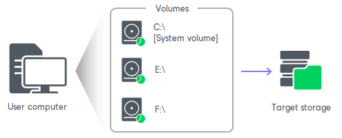
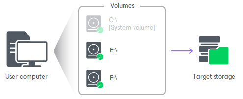

# Volume-Level Backup

You can set up Veeam Agent for Microsoft Windows to create a volume-level backup. The volume-level backup captures the whole image of a data volume (also called logical drive or partition) on your computer. You can use the volume-level backup to restore a computer volume, specific files and folders on the volume or perform bare metal recovery.

You can back up all computer volumes or specific computer volumes.

* When you back up the entire computer image, Veeam Agent captures the content of all volumes on your computer. The resulting backup file contains all volume data and Microsoft Windows OS system data: system partition and boot partition. For GPT disks on Microsoft Windows Server from version 2012 R2 to version 2025, Veeam Agent additionally backs up the recovery partition.

* When you back up a specific computer volume, Veeam Agent captures only that data that resides on this specific volume: files, folder, application data and so on.

If you choose to back up the system volume (volume on which Microsoft Windows is installed), Veeam Agent automatically includes the System Reserved/EFI System Partition into the backup scope. You can exclude the System Reserved/EFI System Partition from the backup if necessary. In this case, Veeam Agent will capture only data on the system volume.

To learn more, see [System State Data Backup](system_state_backup.md).

Related Tasks

[Selecting Volumes to Back Up](backup_job_volumes.md)

