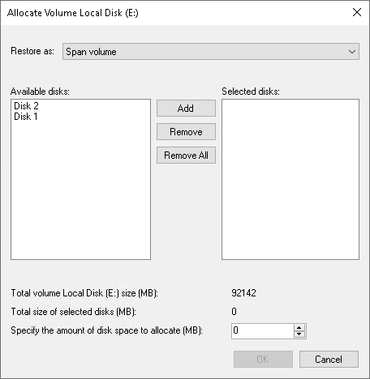

# Allocating Restored Volumes to Dynamic Disks

At the Disk Mapping step of the wizard, you can set the necessary type and size for the restored volumes. A volume will get the specified type and size during the process of data restore.

You can do this only if all the following conditions are met:

* You restore data to a dynamic disk. To learn more about dynamic volume types, see [Microsoft documentation](https://docs.microsoft.com/en-us/windows/win32/fileio/basic-and-dynamic-disks#dynamic-disks).
* At the Restore Mode step of the wizard, you have selected the Manual restore option.
* At the Disk Mapping step of the wizard, you have clicked the Customize disk mapping link.

To set volume type and size:

1. Right-click unallocated space of a dynamic disk and select what volume from the backup you want to place on this disk. Veeam Agent for Microsoft Windows will prompt you to set the restored volume type and size.
2. In the Allocate window, specify the restored volume type:

* If you want to restore the volume as a simple volume, from the Restore as drop-down list, select the Simple volume option and click OK.
* If you want to restore the volume as a spanned, striped, mirrored, or parity volume, from the Restore as drop-down list, select the desired option and specify the following settings:

1. In the Available disks list, select volume extents you want to restore. You can add or delete volume extents using the Add, Remove, and Remove All buttons.
2. In the Specify the amount of disk space to allocate field, specify the total size of restored extents.
3. Click OK.

