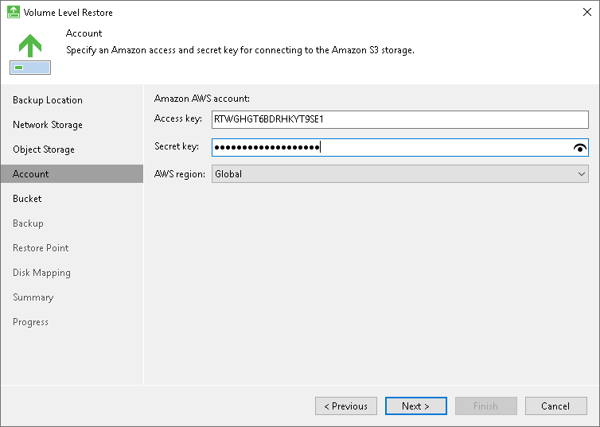
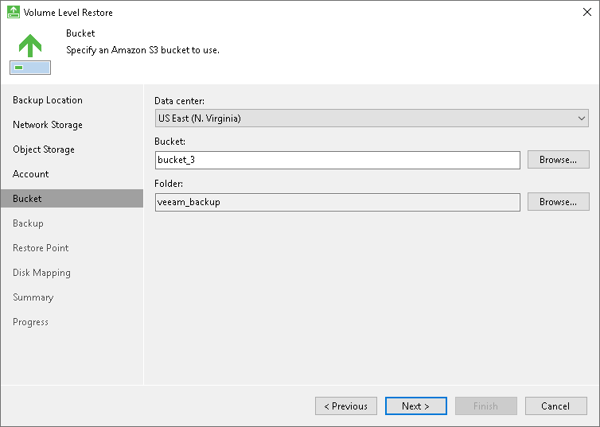

# Amazon S3 Settings

If you have selected to restore data from a backup file located in the Amazon S3 storage, specify the following settings:

1. [Specify account settings](#storage).
2. [Specify bucket settings](#bucket).

Specifying Account Settings

The Account step of the wizard is available if you have chosen to restore data from a backup file located in object storage.

To connect to the Amazon S3 storage, specify the following:

1. In the Access key field, enter the access key ID.
2. In the Secret key field, enter the secret access key.

1. From the AWS region drop-down list, select the AWS region. By default, Veeam Agent uses the Global region.

Specifying Bucket Settings

The Bucket step of the wizard is available if you have chosen to restore data from a backup file located in object storage and specified account settings to connect to the storage.

Specify settings for the bucket in the storage:

1. From the Data center drop-down list, select the geographic region where the backup file is stored.
2. In the Bucket field, specify a bucket in the storage:

1. Select the Browse option.
2. In the Select Bucket window, do the following:

1. Double-click the region name or click the arrow to the left of the region name to view the list of available buckets.
2. Select the necessary bucket and click OK.

1. In the Folder field, specify a folder in the bucket:

1. Select the Browse option.
2. In the Select Folder window, do the following:

1. Double-click the bucket name or click the arrow to the left of the bucket name to view the list of available folders.
2. Select the necessary folder and click OK.

