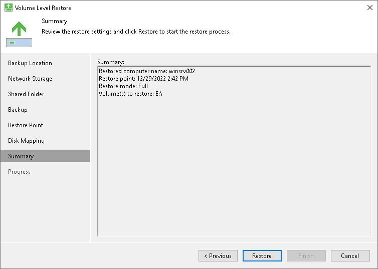

# Step 9. Complete Restore Process

At the Summary step of the wizard, complete the procedure of volume-level restore.

1. Review settings of the restore process.
2. Click Restore to start the recovery process. Veeam Agent for Microsoft Windows will perform partition re-allocation operations if necessary, restore the necessary volume data from the backup and overwrite volume data on your computer with the restored data.

