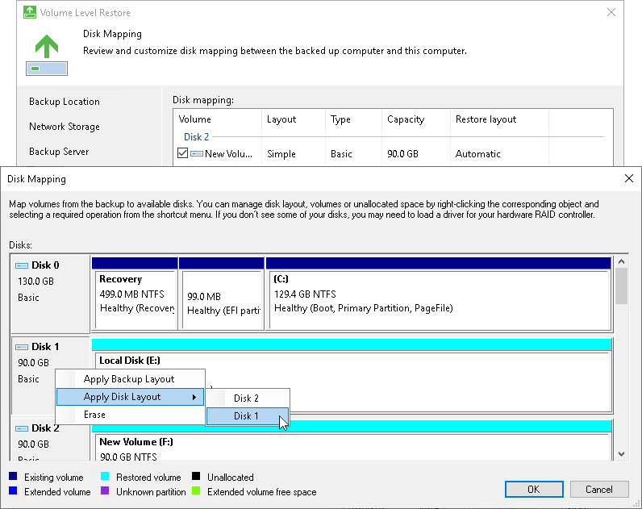
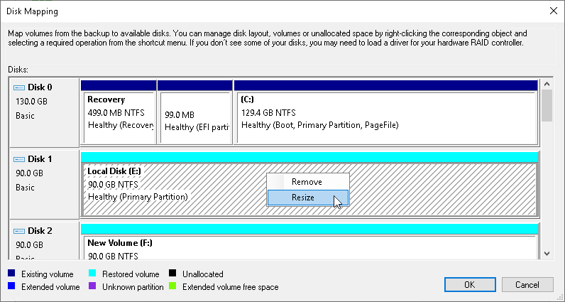

# Step 7. Map Restored Disks

At the Disk Mapping step of the wizard, select what volumes you want to restore and map volumes from the backup to volumes on your computer.

|  |
| --- |
|  IMPORTANT |
| We strongly recommend that you change disk mapping settings only if you have experience in working with Microsoft Windows disks and partitions. If you make a mistake, your computer data may get corrupted. |

To select volumes to restore:

1. Select check boxes next to volumes that you want to restore from the backup.
2. [For restore to a new location] By default, Veeam Agent for Microsoft Windows restores volumes to their initial location. If the initial location is unavailable, a volume is restored to a disk of the same or larger size. To map the restored volume to another computer disk, at the bottom of the wizard click Customize disk mapping. In the Disk Mapping window, specify how volumes must be restored:

* Right-click the target disk on the left and select the necessary disk layout:

- Apply Backup Layout — select this option if you want to apply to disk the settings that were used on your computer at the moment when you performed backup.
- Apply Disk Layout — select this option if you want to apply to the current disk settings of another disk.
- Erase — select this option if you want to discard the current disk settings.

* Right-click unallocated disk space in the disk area on the right and select what volume from the backup you want to place on this computer disk.

If you restore to a dynamic disk, you can specify the type and size of the target volume before mapping. After you select the volume to place on the disk, you will pass to the [Allocate Volume](volume_restore_allocate.md) window.

If you want to change disk layout configured by Veeam Agent for Microsoft Windows, right-click an automatically mapped volume and select Remove. You will be able to use the released space for mapping volumes in your own order.

1. [For restore with volume resize] You can resize a volume mapped by Veeam Agent for Microsoft Windows to a target computer disk. To resize a volume, right-click it in the Disk Mapping window and select Resize. With this option selected, you will pass to the [Volume Resize](volume_restore_resize.md) window.

|  |
| --- |
|  NOTE |
| If you map a backup volume that is larger than the amount of available space on the target disk, Veeam Agent for Microsoft Windows will prompt you to shrink the restored volume. After you agree and click OK, Veeam Agent for Microsoft Windows will prepare to shrink the volume to the size of available disk space. |

