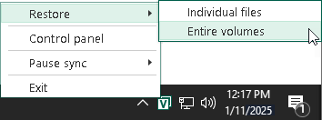

# Step 1. Launch Volume Level Restore Wizard

To launch the Volume Level Restore wizard, do either of the following:

* Right-click the Veeam Agent for Microsoft Windows icon in the system tray and select Restore > Entire volumes.

* Double-click the Veeam Agent for Microsoft Windows icon in the system tray or right-click the icon and select Control Panel. In the control panel, click a bar of the necessary backup job session. Click Restore Volumes at the bottom of the window.
* Double-click the Veeam Agent for Microsoft Windows icon in the system tray or right-click the icon and select Control Panel. In the main menu, hover over the name of the job that that created the backup from which you want to restore data, and select Restore volume.

* From the Microsoft Windows Start menu, select All Programs > Veeam > Tools > Volume Restore.

If Veeam Agent for Microsoft Windows automatically detects backups of your computer in the target location, you will pass immediately to the [Restore Point](volume_restore_point.md) step of the wizard.

