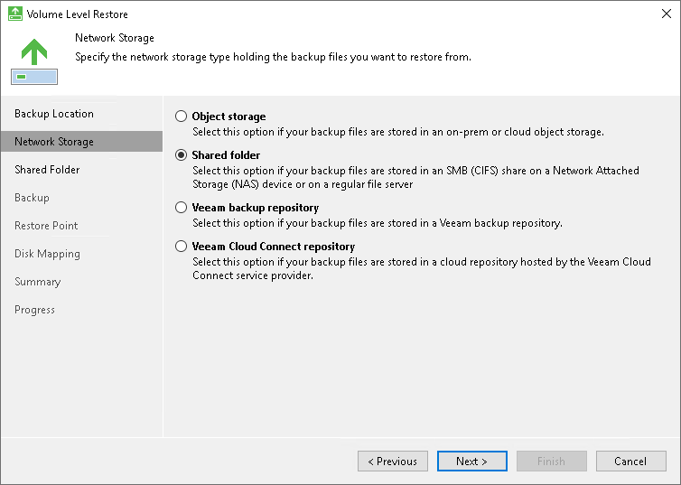

# Step 3. Select Network Storage Type

The Network Storage step of the wizard is available if you have chosen to restore data from a backup file that resides in a remote location — in object storage, in a network shared folder, in a backup repository or in a cloud repository.

Select where the backup file is located:

* Object storage — select this option if the backup file resides in object storage. With this option selected, you will pass to the [Object Storage](volume_restore_object_storage.md) step of the wizard.
* Shared folder — select this option if the backup file resides in a network shared folder. With this option selected, you will pass to the [Shared Folder](volume_restore_share.md) step of the wizard.

* Veeam backup repository — select this option if the backup file resides in a backup repository managed by a Veeam backup server. With this option selected, you will pass to the [Backup Server](volume_restore_vbr.md) step of the wizard.

* Veeam Cloud Connect repository — select this option if the backup file resides in a cloud repository exposed to you by a Veeam Cloud Connect service provider. With this option selected, you will pass to the [Service Provider](volume_restore_sp.md) step of the wizard.

