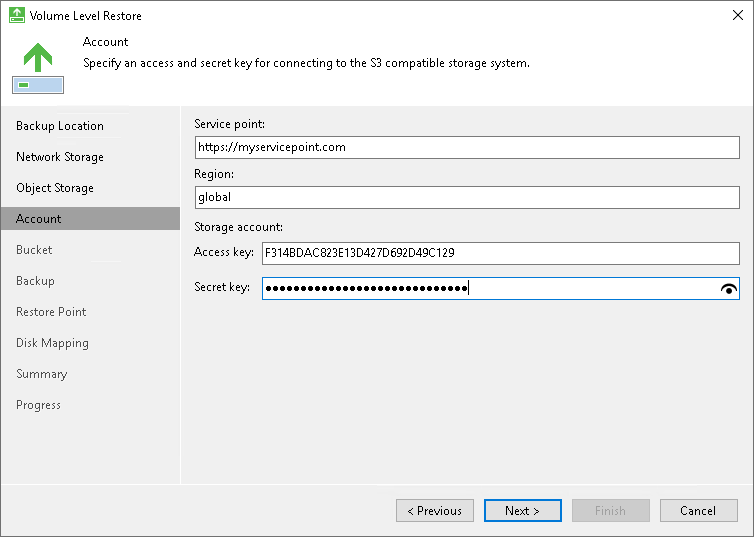
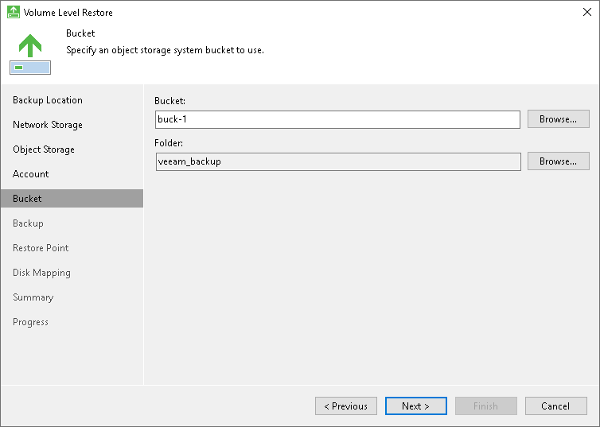

# S3 Compatible Settings

If you have selected to restore data from a backup file located in the S3 compatible storage, specify the following settings:

1. [Specify account settings](#storage).
2. [Specify bucket settings](#bucket).

Specifying Account Settings

The Account step of the wizard is available if you have chosen to restore data from a backup file located in object storage.

To connect to the S3 compatible storage, specify the following:

1. In the Service point field, specify the address of your S3 compatible storage.

If you want to connect to the repository using an IPv6 address and port number, use the following format: <IPv6>:<port>, where:

* IPv6 is the ipv6-literal.net notation of the IPv6 address.
* port is the number of the port that Veeam Agent will use to connect to the cloud storage.

For example: https://2001-db8-1--bb8-c0b8-112.ipv6-literal.net:9000

If you want to connect to the repository using AWS PrivateLink for Amazon S3, use the following format: bucket.<VPС\_endpoint\_ID>.s3.<region>.vpce.amazonaws.com, where:

* VPС\_endpoint\_ID is the unique VPC endpoint ID that Veeam Agent will use to access the cloud storage.

* region is the AWS Region where the VPC endpoint and the S3 bucket are located.

For example: bucket.vpce-0abc123def456ghi7-01234567.s3.ap-northeast-1.vpce.amazonaws.com

To learn more about AWS PrivateLink for Amazon S3, see [AWS Documentation](https://docs.aws.amazon.com/AmazonS3/latest/userguide/privatelink-interface-endpoints.html#accessing-bucket-and-aps-from-interface-endpoints).

1. In the Region field, specify the storage region.
2. In the Access key field, enter the access key ID.
3. In the Secret key field, enter the secret access key.

Specifying Bucket Settings

The Bucket step of the wizard is available if you have chosen to restore data from a backup file located in object storage and specified account settings to connect to the storage.

Specify settings for the bucket in the storage:

1. In the Bucket field, specify a bucket in the storage:

1. Select the Browse option.
2. In the Select Bucket window, do the following:

1. Double-click the region name or click the arrow to the left of the region name to view the list of available buckets.
2. Select the necessary bucket and click OK.

1. In the Folder field, specify a folder in the bucket:

1. Select the Browse option.
2. In the Select Folder window, do the following:

1. Double-click the bucket name or click the arrow to the left of the bucket name to view the list of available folders.
2. Select the necessary folder and click OK.

