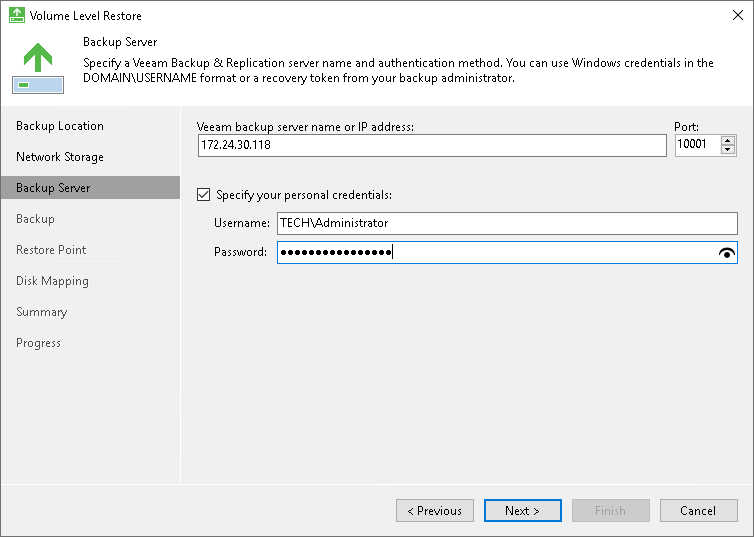

# Backup Server Settings

The Backup Server step of the wizard is available if you have chosen to restore data from a backup file located in a backup repository.

Specify settings for the Veeam backup server that manages the backup repository:

1. In the Veeam backup server name or IP address field, specify a DNS name or IP address of the Veeam backup server.
2. In the Port field, specify a number of the port over which Veeam Agent for Microsoft Windows must communicate with the backup server. By default, Veeam Agent for Microsoft Windows uses port 10005.
3. Select the Specify your personal credentials check box. In the Username and Password fields, enter a user name and password of the account that has access to this backup repository. Permissions on the backup repository managed by the target Veeam backup server must be granted beforehand. To learn more, see [Setting Up User Permissions on Backup Repositories](integrate_permissions.md).

If you do not select the Specify your personal credentials check box, Veeam Agent for Microsoft Windows will connect to the backup repository using the NT AUTHORITY\SYSTEM account of the computer where the product is installed. You can use this scenario if the Veeam Agent computer is joined to the Active Directory domain. In this case, you can add the computer account (DOMAIN\COMPUTERNAME$) to an AD group and grant access rights on the backup repository to this group.

Setting access permissions on the backup repository to Everyone is equal to granting access rights to the Everyone Microsoft Windows group (Anonymous users are excluded). If you have set such permissions on the backup repository, you can omit specifying credentials. However, we recommend this scenario for demo environments only.

